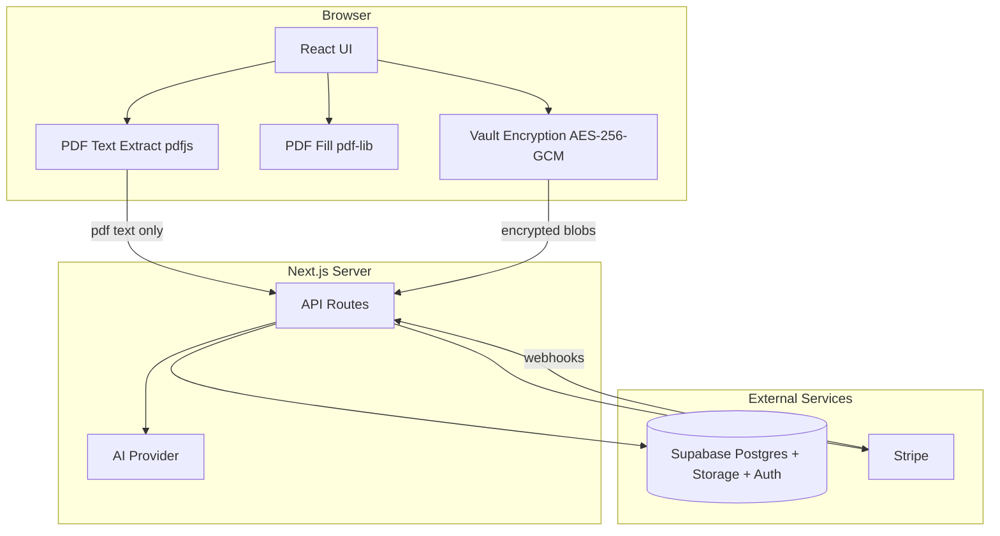

# Architecture

High-level overview of how Formfill works.

## System Diagram

## User Flow

1. **Upload** — User selects a PDF. Text is extracted client-side (max 8 pages).
2. **Analyze** — `POST /api/analyze` sends PDF text to AI → required fields + repeatable groups.
3. **Map** — `POST /api/map-fields` maps PDF field names → canonical profile keys.
4. **Questionnaire** — User answers missing fields. Profile values come from the encrypted vault.
5. **Fill** — PDF is filled entirely in the browser via `pdf-lib`.
6. **Preview** — Live preview with field highlights.
7. **Download** — Registered users consume a credit (`POST /api/billing/consume`). PDF ciphertext may be saved via `POST /api/fill`.

Guests skip vault sync and application history but can preview and download once.

## Encryption Model

### Vault key

Each browser stores a random device secret in `localStorage` (`formfill_device_vault_key_v1`). The vault encryption key is derived with PBKDF2 (310,000 iterations) from this secret and a per-user salt stored in `user_vaults`.

### What gets encrypted

| Payload | Encrypted by | Stored as |
|---------|--------------|-----------|
| Profile fields | Vault key | `user_vaults.ciphertext` |
| Source PDF | Vault key | Supabase Storage (`user-documents` bucket) |
| Filled PDF | Vault key | Supabase Storage |

The server never has the decryption key. It only stores salt + ciphertext.

### Application metadata

`applications` and `application_fields` store form titles, field labels, and counts. **Field values are always `null`** on the server — no PII at rest in Postgres.

## API Routes

### Public / session-scoped

| Route | Auth | Purpose |
|-------|------|---------|
| `GET /api/me` | Session | Current user + billing + role promotion |
| `GET/PUT/DELETE /api/vault` | Session | Encrypted vault CRUD |
| `POST /api/analyze` | Session | AI field analysis |
| `POST /api/map-fields` | Session | AI field mapping |
| `POST /api/fill` | Session | Save application + encrypted PDFs |
| `GET /api/history` | Session | Past applications |
| `GET /api/applications/[id]/pdf` | Session | Download encrypted PDF blob |
| `GET /api/documents` | Session | Form catalog |
| `GET /api/billing/status` | Session | Credits and subscription |
| `POST /api/billing/checkout` | Session | Stripe Checkout |
| `POST /api/billing/portal` | Session | Stripe Customer Portal |
| `POST /api/billing/consume` | Session | Deduct download credit |

### Webhooks

| Route | Auth | Purpose |
|-------|------|---------|
| `POST /api/webhooks/stripe` | Stripe signature | Process payments and subscriptions |

### Admin

| Route | Auth | Purpose |
|-------|------|---------|
| `GET /api/admin/overview` | `super_admin` | Dashboard stats |
| `GET /api/admin/users` | `super_admin` | User list |
| `GET /api/admin/ledger` | `super_admin` | Credit ledger |
| `POST /api/admin/adjust-credits` | `super_admin` | Manual credit adjustment |

## Database Schema

Key tables (see `supabase/migrations/` for full DDL):

- **`user_vaults`** — encrypted profile blob (RLS: owner only)
- **`applications`** / **`application_fields`** — submission metadata (no values)
- **`form_families`** / **`form_documents`** — official PDF catalog
- **`billing_accounts`** / **`credit_ledger`** / **`download_grants`** — credits and Pro tier
- **`field_keys`** — canonical field name catalog

RPCs:

- `consume_download_credit` — atomic credit deduction (security definer, checks `auth.uid()`)
- `reset_billing_period_if_needed` — monthly free credit reset
- `find_form_document_by_hash` — catalog matching

## Auth

- **Middleware** (`src/middleware.ts`) refreshes Supabase session cookies on every request
- **Anonymous** — `signInAnonymously()` for guests
- **Email OTP** — magic link via `/auth/callback`
- **Passkeys** — WebAuthn via Supabase experimental passkey support
- **Super admin** — emails in `SUPER_ADMIN_EMAILS` get `app_metadata.role = "super_admin"`

## Field System

`src/lib/field-keys.ts` is the source of truth for profile field names, aliases, and normalization. AI mapping output is validated against these keys.

Special field types: dates, addresses, comboboxes, Elterngeld schedules, signature pads, repeatable household members.

## AI Provider Selection

`src/lib/ai/provider.ts`:

1. `AI_PROVIDER` env var if set (`anthropic` | `huggingface`)
2. Else Hugging Face if `HF_TOKEN` or local `HF_BASE_URL`
3. Else Anthropic

Both providers return structured JSON for field analysis and mapping.
